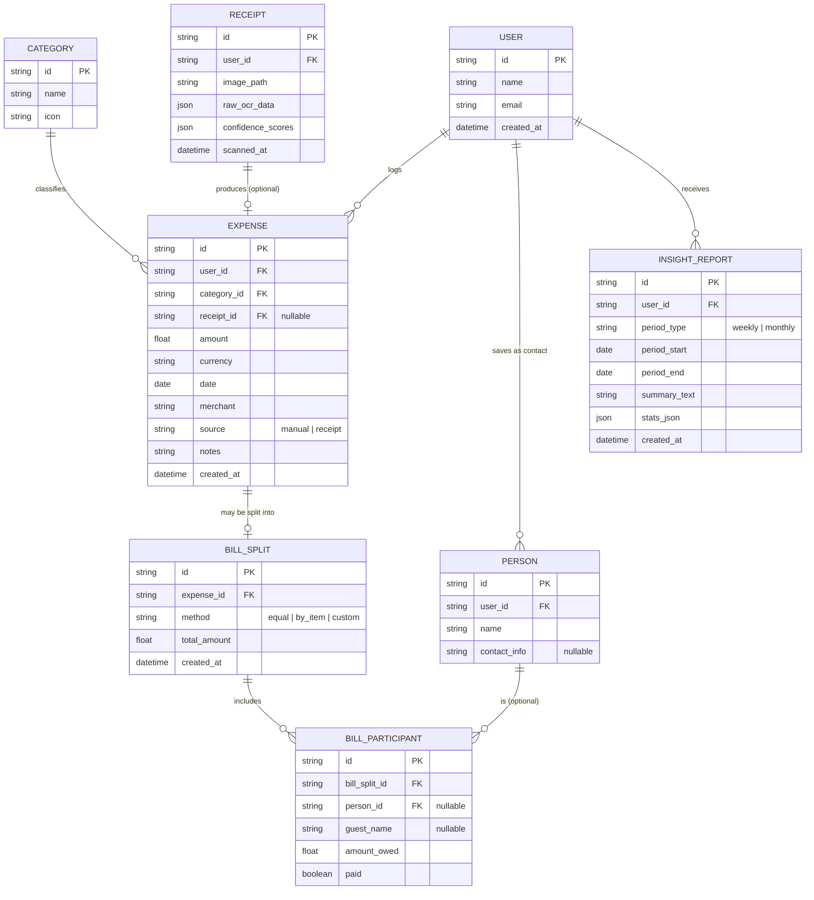

# Littlefinger — Product Requirements Document & Build Plan

**Version:** 0.1
**Purpose of this doc:** Hand this file to an AI coding agent (e.g. OpenCode) as the single source of truth to scaffold and build the app end-to-end.

---

## 1. Overview

Littlefinger is a personal finance tracker that removes the friction of logging expenses. Instead of manually typing every transaction, the user can snap a photo of a receipt and have it categorized automatically, split a bill with friends in a couple of taps, and get a plain-English summary of their spending every week without opening a spreadsheet.

This is a **single-user, personal-use app first** (built by one person, for one person), with the data model designed so it *could* grow to multi-user later without a rewrite.

---

## 2. Objectives

| Objective | Why it matters |
|---|---|
| Reduce the effort of logging an expense to under 10 seconds | Friction is the #1 reason people abandon finance trackers |
| Keep categorization consistent | A fixed taxonomy keeps charts and trends meaningful over time |
| Make shared expenses (bills split with friends) painless to track | Manually remembering who owes what is the most common finance-tracking pain point |
| Turn raw transaction data into an actual insight, not just a table | Numbers alone don't change behavior; a sentence like "you spent 40% more on dining this week" does |
| Keep the stack small enough to build and maintain solo | This is a side project, not a startup — operational simplicity beats scalability |

### Success looks like
- Logging a receipt-based expense takes ≤ 3 taps after the photo is taken.
- Categorization is correct (no manual fix needed) more than 80% of the time.
- The weekly insight is something the user actually reads, not something they dismiss.

---

## 3. Target User

Just one persona for v1: **the builder themselves** — someone who wants a lightweight, no-friction way to track personal spending, occasionally splits bills with friends, and wants a weekly nudge about spending patterns rather than having to dig through a dashboard to find it.

---

## 4. User Requirements (Functional, from the user's point of view)

1. As a user, I want to **scan a receipt** and have the app read the merchant, items, and total, and assign a category automatically, so I don't have to type it in.
2. As a user, I want to **split a bill** — either right after scanning a receipt or from a manually entered expense — among a group of people, and know who owes what.
3. As a user, I want to **manually add an expense** (for cash payments or when I don't have a receipt) and pick a category myself.
4. As a user, I want a **dashboard** that shows me where my money is going — by category, by time period, and as a trend over time.
5. As a user, I want a **weekly and monthly summary** written in plain language, telling me what changed and what stood out, without me having to interpret charts myself.
6. As a user, I want confidence that if the app mis-reads a receipt, I can **quickly correct it** before it's saved.
7. As a user, I want categories to stay **consistent** — I don't want the app inventing a new category every time.

---

## 5. Feature Flows

### 5.1 Receipt Scanner + Auto-Categorization (Multi-Step Wizard)

Entry point: **"Scan"** button on the expenses page header.

The scanner is a single dialog with 5 internal steps:

```
Upload → Review Items → Add Participants → Choose Method → [Assign Items] → Confirm
Step 1        Step 2            Step 3            Step 4          Step 5        Done
```

**Step 1 — Upload:** Drag-and-drop or click to select a receipt image. Sends the image to the backend for LLM-based OCR parsing. Shows a loading spinner while scanning. On success, advances to Step 2 automatically.

**Step 2 — Review Items (mobile-first card layout):**
- Editable header fields: Merchant, Date, Currency
- Each line item rendered as a rounded card:
  - **Mobile:** description full width, category + confidence below, quantity/price/amount stacked
  - **Desktop:** description + category + confidence in one row, quantity/price/amount in a second row
- Tax & additional charges input
- Running total display
- Add/remove items
- Low-confidence items flagged with a badge (High/Medium/Low)
- Footer: Cancel | **"Next: Add People"**

**Step 3 — Add Participants:**
- **"Include myself"** toggle at top (default ON — shows "You" as the first participant)
- List of added participants with remove button, each shown as a row with avatar + name + X
- Saved contacts shown as clickable pill buttons
- Guest name text input with "Add" button
- Minimum 2 participants required to proceed
- Footer: Cancel | **"Next: Split Method"**

**Step 4 — Choose Method (combined with detail view):**
- Back button to Step 3
- Dropdown select with 4 split methods:
  - **Equal** — shows computed per-person amounts (read-only)
  - **Percentage** — per-person percentage inputs, total must equal 100%
  - **Custom** — per-person amount inputs with remaining indicator
  - **By Item** — shows a description card with a **"Configure Split"** button → navigates to Step 5
- Footer: Cancel | **"Confirm & Create Expense"** (for equal/percentage/custom)

**Step 5 — Assign Items (by-item only):**
- Full `BillItemAssignmentEditor` component
- Participant bar at top (horizontal scrollable chips)
- Per-item cards showing:
  - Item name and total price
  - Each assigned participant with optional ratio inputs (`[1] : [4]`)
  - **"Split evenly among all"** checkbox per item (default ON)
  - Add/remove individual participants per item
  - Warning indicator if item has no assignments
- Live summary at bottom showing each participant's total, number of items, and grand total
- Taxes & charges always split evenly among all participants
- Footer: Cancel | **"Confirm & Create Expense"**

**On confirm:** Creates the expense (with receipt items stored as JSON), then creates a `BillSplit` record with participants (and `BillItemAssignment` records if by-item). Automatically opens the Split Result Summary modal (Step 6).

### 5.2 Split Bill

Entry points:
- From the expense list page via the action menu (**"Split Bill"** on non-split expenses, **"View Split"** on split expenses)
- From the **"Edit Split"** button inside the `SplitResultModal` (only within 24h of creation)

**Creating a new split (standalone):**
1. User selects an expense from the list and taps **"Split Bill"** in the action menu.
2. Opens `SplitBillDialog` with 2 steps:
   - **Step 1 — Participants:** Add people (from saved contacts or guest input). At least 2 required.
   - **Step 2 — Method + Detail:** Dropdown selects between Equal, Percentage, Custom, By Item. Content below the dropdown changes dynamically:
     - **Equal:** Read-only computed amounts
     - **Percentage:** Per-person percentage inputs (must sum to 100%)
     - **Custom:** Per-person amount inputs with remaining indicator
     - **By Item:** "Configure Split" button (navigates to a simplified assignment review)
3. On confirm → calls `POST /api/bill-splits` with method, participants, and optionally item assignments.
4. Each participant can later be marked **"Paid"** from the expense list's inline summary.

**Creating a split from the receipt scanner:**  
The entire split flow is embedded inside the scanner wizard as Steps 3-5 (see 5.1). No separate dialog needed.

**Viewing/Editing a split:**
1. From the expense list, expenses with a split show an inline summary with a **"Details"** link.
2. Clicking opens `SplitResultModal` showing:
   - Expense merchant, total, method, and participant count
   - Per-participant breakdown: total owed, with item-level details if by-item (e.g. *"Item X (20% share)"*)
   - Grand total at the bottom
3. If the split was created less than 24 hours ago, an **"Edit Split"** button appears.
4. Clicking Edit opens `SplitBillDialog` in edit mode (`mode="edit"`), pre-filled with existing participants, method, and amounts.
5. After 24 hours: view-only mode (no edit button, backend returns 403 on PUT).

**BillItemAssignment (by-item data model):**
- A new `BillItemAssignment` table stores per-item, per-participant assignment data:
  - `itemIndex` — index into the receipt items array
  - `participantId` — FK to `BillParticipant`
  - `amount` — calculated share for this participant
  - `splitRatio` — optional string like `"1:4"`; null means even split
- Taxes & charges are always split evenly among all participants, computed server-side.

### 5.3 Manual Expense Entry
1. User taps **"+ Add Expense"**.
2. Simple form: amount, merchant/description, date (defaults to today), category (dropdown, fixed list), optional notes.
3. Optional **"Split this bill"** toggle → jumps into 5.2.
4. User taps **"Save"** → expense written to the database.

### 5.4 Bulk Expense Entry (Table-based)
1. User taps **"Bulk Entry"** on the expenses page → view switches from the expense list to an editable table.
2. Table columns: Amount (with currency symbol prefix), Currency (per-row), Date, Merchant, Category, Notes, Delete row.
3. Each row represents one transaction. User can add as many rows as needed via **"+ Add Row"** button.
4. Rows are pre-filled with sensible defaults: today's date, user's preferred currency.
5. Per-row validation on blur (amount > 0, merchant required, category required). Invalid rows are visually flagged.
6. A summary footer shows total expense count and running sums grouped by currency.
7. User taps **"Save All"** → all rows are validated; if any fail, the first error row is scrolled into view.
8. On success, all expenses are created in a single backend transaction, and the view returns to the refreshed expense list.
9. User can cancel via **"Back to List"** — unsaved rows are discarded.

### 5.5 Finance Tracker Dashboard
1. Home dashboard shows, for the selected period (week/month/year — toggle at top):
   - Total spend.
   - Category breakdown (bar or donut chart).
   - Spend-over-time trend line.
   - The latest weekly/monthly insight card (from 5.5) pinned near the top.
   - A recent-transactions list.
2. Tapping a category filters the transaction list to just that category.
3. Tapping a transaction opens it for editing (category, amount, notes) or deleting.
4. A simple date-range filter/search bar lets the user look at any custom period.

### 5.6 Weekly / Monthly Insight Agent
1. A scheduled job runs automatically (every Monday morning for weekly, 1st of the month for monthly — configurable).
2. The job pulls structured aggregate data for the period (totals by category, day-by-day totals, comparison vs. the prior equivalent period) — **not raw receipt images**, just numbers.
3. This structured summary is sent to an LLM with a tightly scoped prompt asking for a 2–3 sentence, plain-language insight (e.g. *"You spent 40% more on dining than usual, mostly from 3 orders on Friday."*).
4. The result is stored as an `InsightReport` and surfaced on the dashboard.
5. User can view a **history** of past insights from a "Past Insights" screen.
6. User can also trigger an insight manually ("Generate insight now") for the current partial period, useful for testing.

---

## 6. Suggested Additional Features (not in scope for v1, but worth planning the schema around)

| Feature | Why it's useful |
|---|---|
| **Budgets & alerts** | Set a monthly cap per category; get notified when you're close to it. Natural extension of the fixed taxonomy. |
| **Recurring/subscription detection** | Flag expenses that repeat monthly (e.g. same merchant + similar amount) so subscriptions don't sneak up on you. |
| **Duplicate receipt detection** | Warn if a near-identical receipt (same merchant, date, total) is scanned twice. |
| **Savings goals** | A simple "saving toward X" tracker that nets off discretionary spend. |
| **CSV/PDF export** | Export a period's transactions for taxes or personal records. |
| **Multi-currency support** | Useful if you travel — store the original currency + a converted amount. |
| **Bank statement import (CSV)** | Bulk-import transactions instead of manual entry, reconciled against receipts. |
| **Tagging (in addition to category)** | Free-form tags like "vacation" or "work-reimbursable" layered on top of the fixed category, without breaking the clean taxonomy. |
| **"Bills owed to you" view** | A dedicated screen listing all unpaid BillParticipants across all your split bills. |
| **Offline-first mode** | Queue manual expenses locally when offline, sync when back online. |

---

## 7. Technical Requirements

### 7.1 Architecture

A single repository, two services — kept intentionally simple (a "modular monolith," not microservices):

```
littlefinger/
├── frontend/          # Next.js app (React + shadcn/ui + Tailwind)
│   ├── app/
│   ├── components/
│   ├── lib/
│   └── package.json
├── backend/           # Express API
│   ├── src/
│   │   ├── routes/
│   │   ├── controllers/
│   │   ├── services/       # receipt parsing, categorization, insight generation
│   │   ├── jobs/            # cron job for weekly/monthly insights
│   │   └── db/
│   ├── prisma/
│   │   └── schema.prisma
│   ├── uploads/         # local receipt image storage (dev)
│   └── package.json
└── README.md
```

- **Frontend:** Next.js (App Router), React, Tailwind CSS, shadcn/ui for components, Recharts (or shadcn's chart components) for the dashboard visualizations.
- **Backend:** Express.js, plain REST API, no GraphQL needed at this scale.
- **ORM:** Prisma (works cleanly with SQLite now and Postgres later with almost no code change).
- **LLM calls:** made from the backend only (never directly from the frontend), so API keys stay server-side.

### 7.2 Database: use SQLite, not localStorage

**Recommendation: SQLite (via Prisma), not browser localStorage.**

Reasoning:
- **localStorage lives only in the browser** — it disappears if you clear browser data, doesn't sync across devices, and can't be read by a server-side scheduled job (which is exactly what the weekly insight agent needs to do). It's a non-starter for anything beyond a pure client-side toy.
- **SQLite** is a single file, needs no separate database server to install or manage, is trivial to back up (just copy the file), and is genuinely fine for single-user data volumes — a personal expense tracker will realistically never come close to SQLite's limits.
- If you ever want to add a second user, a hosted deployment, or concurrent writes from multiple devices, **Postgres** is the natural upgrade — and because you're using Prisma, that's a one-line change to the datasource, not a rewrite.

**Where receipt images go:** store them on local disk (`backend/uploads/`) for now, referenced by file path in the database. If you later deploy this somewhere persistent-storage-unfriendly (like a serverless platform), swap to a cheap object store (e.g. Cloudflare R2 or S3) — the code should read/write images through a small storage service module so that swap is contained to one file.

### 7.3 LLM Integration

Following on from the model discussion earlier: use OpenRouter, called only from the backend.

- **Receipt scanning** needs a **vision-capable** model (e.g. via the `openrouter/free` router, which auto-filters for models supporting image input, or a specific vision model). Given this touches real financial documents, prefer a model with a clear no-training-on-data policy once you're past the prototyping stage — free-tier variants may have different data-retention terms than paid ones.
- **Categorization** should be enforced via a **strict JSON schema** with `category` constrained to an enum (the fixed list below). Validate the response server-side; if the model returns anything outside the enum, fall back to `"Other"` rather than trusting it blindly.
- **Insight generation** sends only **aggregated numbers** (never raw receipt images or line-item text) to the LLM — smaller prompt, cheaper, and better for privacy.

**Fixed category list (v1):**
```
Groceries, Dining, Transport, Utilities, Entertainment,
Shopping, Health, Housing, Travel, Subscriptions, Other
```
This list should live in one place (a constant/config, and seeded into the `Category` table) so both the frontend dropdown and the LLM prompt's enum always match.

**Example receipt-extraction response schema:**
```json
{
  "merchant": "string",
  "date": "YYYY-MM-DD",
  "items": [
    { "name": "string", "price": 0.0, "confidence": 0.0 }
  ],
  "subtotal": 0.0,
  "tax": 0.0,
  "total": 0.0,
  "currency": "USD",
  "suggested_category": "Groceries | Dining | Transport | Utilities | Entertainment | Shopping | Health | Housing | Travel | Subscriptions | Other",
  "confidence": {
    "merchant": 0.0,
    "date": 0.0,
    "total": 0.0,
    "category": 0.0
  }
}
```

### 7.4 API Design (REST)

| Method | Endpoint | Description |
|---|---|---|
| GET | `/api/categories` | List the fixed category taxonomy |
| GET | `/api/expenses` | List expenses (filters: date range, category, source) |
| POST | `/api/expenses` | Create a manual expense |
| POST | `/api/expenses/bulk` | Create multiple expenses in a single transaction |
| GET | `/api/expenses/:id` | Get one expense |
| PUT | `/api/expenses/:id` | Update an expense |
| DELETE | `/api/expenses/:id` | Delete an expense |
| POST | `/api/receipts/scan` | Upload a receipt image → returns a draft (unsaved) parsed expense |
| POST | `/api/receipts/confirm` | Save a confirmed/edited draft as a real expense + receipt record |
| GET | `/api/receipts/:id` | Get receipt details (image ref + parsed data) |
| GET | `/api/people` | List saved contacts (for bill splitting) |
| POST | `/api/people` | Add a new contact |
| POST | `/api/bills` | Create a bill split (expense/receipt id, participants[], method) |
| GET | `/api/bills/:id` | Get a bill split + participant statuses |
| PATCH | `/api/bills/:id/participants/:participantId` | Mark a participant paid/unpaid |
| GET | `/api/dashboard/summary?range=` | Totals + category breakdown for a period |
| GET | `/api/dashboard/trends?range=` | Time-series spend data for charts |
| GET | `/api/insights?period=weekly\|monthly` | List past insight reports |
| POST | `/api/insights/generate` | Manually trigger insight generation (also called internally by the cron job) |

### 7.5 Non-functional requirements
- **Security:** never commit API keys; load `OPENROUTER_API_KEY` and `DATABASE_URL` from `.env` (gitignored). Validate uploaded file type/size for receipts (images only, reasonable size cap).
- **Resilience:** if the LLM call for categorization or extraction fails or times out, don't block saving — fall back to `"Other"` category / empty fields the user can fill in manually.
- **Consistency:** categories are never freely created by the LLM or the user in v1 — only the fixed list is selectable, to keep charts meaningful over time.
- **Auth:** not required for v1 (single local user). Leave a placeholder middleware in Express so a simple password/PIN gate can be added later without restructuring routes.

### 7.6 Environment variables
```
DATABASE_URL="file:./dev.db"
OPENROUTER_API_KEY="..."
PORT=4000
NEXT_PUBLIC_API_URL="http://localhost:4000"
```

---

## 8. Data Model & Entity Relationships

### Entities
- **User** — the app owner (kept even for a single-user app, to future-proof for multi-user).
- **Category** — the fixed taxonomy (seeded, not user-created).
- **Expense** — a single transaction, manual or receipt-derived.
- **Receipt** — the scanned image + raw/parsed OCR data, optionally linked to one Expense.
- **Person** — a saved contact used for bill splitting.
- **BillSplit** — a split attached to one Expense.
- **BillParticipant** — one person's share within a BillSplit.
- **InsightReport** — a generated weekly/monthly summary.

### Relationship Graph (ER Diagram)



Notes on the model:
- `Expense.receipt_id` is nullable — manual expenses have no receipt.
- `BillParticipant` supports either a saved `Person` (reusable across bills) or a one-off `guest_name` if the user doesn't want to save a contact.
- `Category` is intentionally **not** owned per-user — it's a shared, fixed, seeded table so the taxonomy can't drift.

---

## 9. Suggested Build Order (Milestones)

1. **Phase 0 — Scaffold:** monorepo structure, Next.js app with shadcn installed, Express server skeleton, Prisma + SQLite wired up, a health-check endpoint, categories seeded.
2. **Phase 1 — Manual tracking core:** manual expense CRUD + category dropdown + a basic transaction list/dashboard (totals only, no charts yet).  
   - *Phase 1a — Bulk entry:* table-based bulk expense form with per-row currency, inline validation, and `POST /api/expenses/bulk` endpoint.
3. **Phase 2 — Receipt scanner:** image upload, LLM extraction service, draft/confirm screen, save as Expense + Receipt.
4. **Phase 3 — Split bill:** Person/contact management, BillSplit + BillParticipant creation from both receipt and manual flows, "who owes what" views.
5. **Phase 4 — Dashboard polish:** category breakdown chart, trend-over-time chart, date-range filtering.
6. **Phase 5 — Insight agent:** cron job, aggregate-stats service, LLM insight generation, insight card + history screen.
7. **Phase 6 — Stretch:** pick from Section 6 based on what's actually missing after using the app for a while.

---

## 10. Open Questions / Assumptions
- **Multi-currency supported from v1** — the schema stores a `currency` per expense and the bulk entry UI allows per-row currency selection. Multi-currency grouping/aggregation in the dashboard is still a stretch feature.
- Assuming **local-only deployment** (running on your own machine) for v1 — no auth, no cloud hosting yet.
- Assuming receipt OCR is done **in one LLM vision call** (extraction + categorization together) rather than a separate OCR step + separate LLM call — simpler, fewer moving parts, revisit only if accuracy is poor.
- Weekly insight runs **Monday**, monthly runs **1st of the month** — adjust in the cron config if a different cadence is preferred.